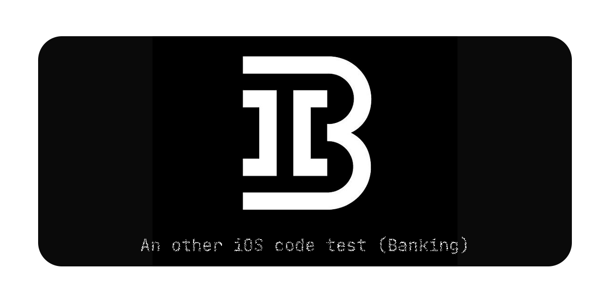
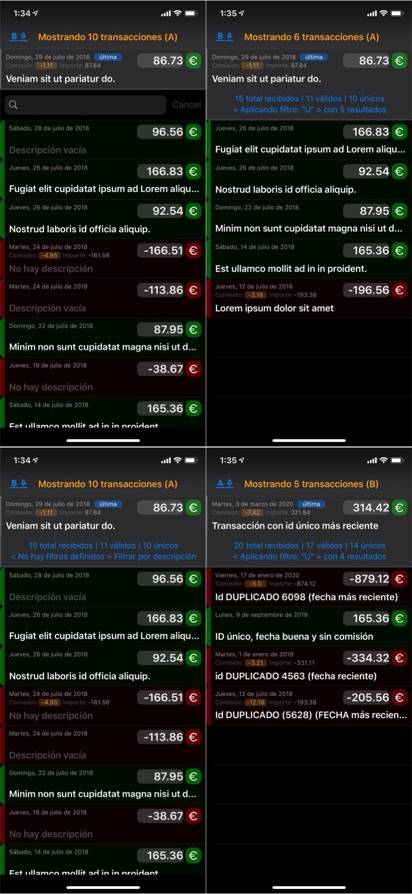
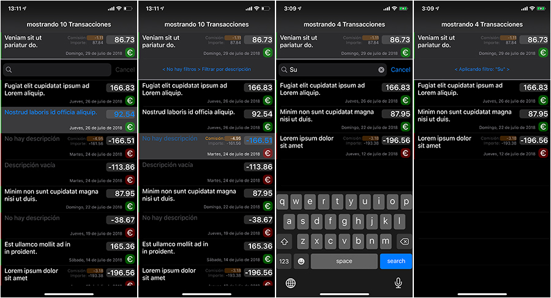

# iOSCodeTestB
An other iOS code test (Banking)

___
> April 2, 2020 update: **The API used in this proyect is down**, "Consultando transactiones…" and "Espere, leyendo contenido…" are the espected feedback on launch App since this date. [myjson has officially been shut down today](https://twitter.com/lance_ramoth/status/1245515531710390272?s=20). Please, let my know your interest to use an alternative API if you want watch the list in action! in the meantime, please [check it out my other Swift / SwiftUI public repositories](https://github.com/ssuperw?tab=repositories)
___
Changelog:

1.0.3
- [ * ] Testing: add some little unit tests

1.0.2
 - [ √ ] Hotfix:  remove duplicates
 - [ * ] Visual:  redesign cells
 - [ * ] Feature: ability to change between two different endpoints (A or B) through a button bar
 - [ * ] Tip: use dark mode

1.0.1
 - [ √ ] Show total amount including the fee, if exist a fee
 - [ √ ] Show green when there is an income and expenses in red
 - [ √ ] Discarded wrong date formatted item (not displayed)
 - [ √ ] Discarded duplicates (by Id, and older) -> fixed in 1.0.2
 - [ √ ] Sorted by descending date
 - [ √ ] Show on the top the last transaction
 - [ * ] Implemented a simply filter (by description)
 
 
 
